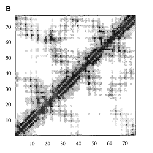

# Assignment 6: Some Final Questions
### By Philip Hansson
____

## Question 1.
*One of the learning outcomes of this course is that you should be able to "identify situations where the same computational methods are applied in addressing different problems, even across different application areas".*

*Give two computational methods that are used in (at least) two different contexts in this course. For each of the two methods:*
-  *Describe two different tasks that were mentioned in this course where the method is used.*
- *Describe one application of that method outside of bioinformatics.*

**Answer:**

As a CS student, I will chose two methods I have been more familiar with before.

### Dynamic programming
Dynamic Programming was used primarily in the first lab, and during the course for Global Alignment (Needleman-Wunsch), and in the Local Alligment (Smith-Waterman). Utilizing this we were able to calculate the highest score path in the matrixes assigned to us, utilizing of course, dynamic programming in the sense of breaking it down into smaller sub-problems (often recursively) and in our case, smaller matrices.

It was also used later in the course for the CYK , zipping and assembly of hierarchical protein folding under constraints. It uses ses dynamic programming over sequence intervals describing it in a "bottom-up parsing" algorithm. To summarize, in the table entry, each entry would represent the best way to “assemble” a subsequence. 

I can with this one in particular describe a way I know this has been used, we utilized the CYK algorithm to let us transform a grammar and parse it in after having converterd the grammar via a Chomsky Normal Form and see if there would be a parse tree for said grammar, I will refer to the course Finite Automata & Formal Languages: DIT323/TMV029, here on Chalmers. Hence the "Dynamic Programming" aspect, via the CYK algorithm, is used in a Formal Language Computer Science setting to parse strings with a context free grammar and to construct a corresponding parse tree.

### Clustering
Clustering appeared several times in the course, notably in Molecular Dynamics (MD) simulations and assignment 4. 
In assignment 4 we "Discretize the trajectory into 50 clusters" and processed this into a discrete trajectory. Then computing the count matrix, which is the required input for estimating the MSM transition matrix. 
As described in the lecture clustering is the step that turns continuous molecular dynamics conformatives(?) into a finite set of discrete states so that the dynamics can be modeled with a Markov transition matrix, and this by utilizing a pretty standard pipeline: data-preprocessing in the form of feature selection and the dimensional reduction. it suggests also k-means.

In other computational method settings, it was also used in the NMR: Nuclear Magnetic Resonance structural ensembles (MACROMOLECULAR STRUCTURE DETERMINATION BY NMR). Described in one of the notes as utilizing NMRCLUST algorithm to "find clusters of similar structures within an ensemble of model structures". This means we use it to cluster the set of NMR models to identify groups of models, that are similar and represent distinct "modes" of the total all around ensemble.

Outside of Clustering in Bioinformatics, I have previously used it in a academic setting at National University of Singapore (NUS) course: IS3221, in a Business Analytics setting for a project utilizing S.A.P. (the ERP program) data from a retailing store. In this project we utilized clustering and based it around purchasing behaviour and other features for identifying churning, pricing, targeted marketing segments etc. I mean, could be used anywhere pretty much in regards to unsupervised learning but this would be very applicable, Business Analytics for predicting customer behaviour.
____
## Question 2.
*Watch the 2024 Nobel Prize lectures in chemistry. Discuss how any topics or slides from those lectures connect with topics or slides from this course.*
https://www.youtube.com/watch?v=HnT1VWzdFWc

**Answer:**

First talker, David Baker, talks about De Novo Protein design and focuses heavily more on application wise side versus our course. De Novo itself is directly connected with the Lecture 10 in our case, where the top7 sequence design approach start out by utilizing starting models generated by "a de novo approach (‘‘Rosetta’’)". The lecturer also then talks how it works at a more high level (overviewing) with him comparing the traditional ways finding proteins (loking all through nature to find the natural occuring protein) and the modern ones, especially deep learning which we also have kinda tackled in the assignment 5. Something we did not do, was the parts about comparing AI image generative aspects for generating synthetic designs for proteins.

But all and all, "Computational Protein Design" foundation I mean has been part of the course, only he dives a lot deeper into it versus us. His Nobel lecture focuses a lot on modern generative design.

The second lecturer, Demis Hassabis, dives even deeper with machine learning, into protein structure prediction. Utilizing the AlphaFold, as also described in the lecture 13 as well and touched upon, "AlphaFold program has determined the shape of around two thirds of the proteins with accuracy comparable to laboratory experiments".
 Demis Hassabis stays mostly at a higher level of AI system explanation, but lecture 13 adds more "bioinformatics pipeline" to this I believe.

To summarize, I believe both Hassabis and Baker to have been namedropped and pretty much also summarized in the lecture 13. Whereas all the research from before are seemingly based around the course content as well, I think mostly lecture 13 is the important one to be comparable with their lectures as they dive into the more "modern" sphere of computation with machine learning. However the course adds a lot of background to what they are talking about, as previously mentioned, a more "pipeline" more within a bioinformatics sphere.

____
## Question 3.
*On page 972 of the article by Morris et al. (2002) the authors state: "The presence of cis-peptides adds an extra complication that we have chosen to ignore". Discuss this "complication", and why the authors chose to ignore it.*
http://dx.doi.org/10.1107/S0907444902005462

**Answer:**

Completely from my understanding, but trans-peptides are much more common (by alot), and the cis-peptide due to not following the same geometry as the trans-ones and are much more rare. From the article, basically due to it's uncommon nature it would require extra handling to be traced correctly. therefore the authors accept that the tracing may break at certain positions (cis-peptides), and due to this it is the "extra complication that we have chosen to ignore". 

____
## Question 4.
*On page 219 of the article by Simons et al. (1997) the authors state: "the similarity in topology is clear ... in the contact map (Figure 9B)". Explain what the authors mean by this.*

*Figure in question:*

http://dx.doi.org/10.1006/jmbi.1997.0959

**Answer:**

The figure is a depiction of the "native calbindin in the upper right triangle and the simulated structure in the lower left". And in this case, as depicted in the figure, the same clusters and contacts between the same regions of around the sequences should appear in both images as they do, hence the "Similarity in topologu is clear", which I agree, the different regions do appear similiar. The simulated structure has "folded" in a similiar way to the native one (with clusters I'm talking about the different shadings).

/Users/ik-joong/Documents/SKOLA/OOPROJEKT_2/OOPP-team-16_FINAL/docs/BioInformatics_Assignment6.md